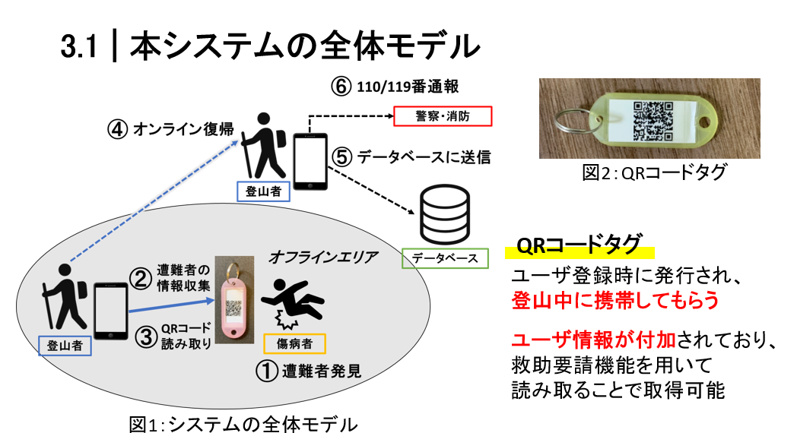

# mountain_rescue_app

このwebアプリケーションは、学部4年次の研究で作成したFlutterアプリケーションのコード置き場です。私が書いたコードはlib配下のコードになります。

アプリケーションのリンク：https://mountain-rescue-app.web.app/

このアプリはスマートフォンから利用することを想定しています。また、インターネット通信が不安定な山岳地で利用することを想定しているため、Service Workerの機能によりキャッシュを利用しております。これにより、オフラインでも利用可能になっています。

また、すでにデータベースは閉じているため、各種情報送信機能は利用できません。

## 研究内容
「山岳遭難時の救助要請支援システムの構築に関する研究」であり、遭難者やその発見者が救助要請を簡単に行うことを目的としたシステムの構築をしました。具体的には遭難救助要請用のWebアプリケーションと、登山者の個人情報に紐づけられたQRコードタグを持たせることで、自分自身が遭難した際や遭難者を発見した際に、簡単に救助要請ができるように補助をするシステムを構築しました。システムの全体モデルは以下の通り。

## お願い
これは私個人のポートフォリオとして一時的に公開しているコードです。また、2022年に開発したコードであるため実装が古く、現在のversionではそのまま利用できないコードである可能性があります。